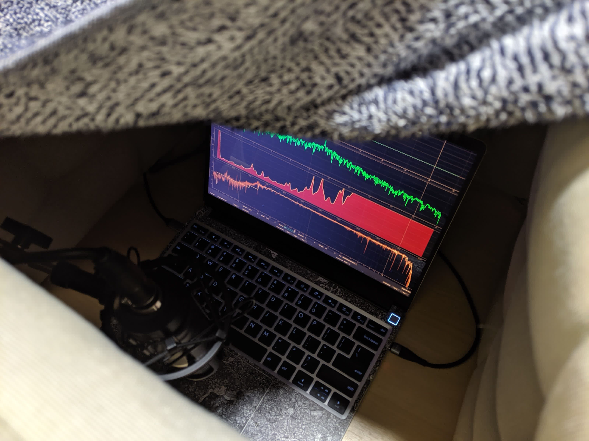

EasyEffects Framework DSP profiles
=======

There's a [progress thread](https://community.frame.work/t/guide-yet-another-easyeffects-profile/40509/) on Framework community forum.

## Installing

For a change, not a `curl | bash`, but a `curl | unzip`. Paste in your bash/zsh/sh terminal and you should be good to go.

```bash
TMP=$(mktemp -d) && \
CFG=${XDG_CONFIG_HOME:-~/.config}/easyeffects && \
curl -Lo $TMP/fwdsp.zip https://github.com/cab404/framework-dsp/archive/refs/heads/master.zip && \
unzip -d $TMP $TMP/fwdsp.zip 'framework-dsp-master/config/*/*' && \
sed -i 's|%CFG%|'$CFG'|g' $TMP/framework-dsp-master/config/*/*.json && \
cp -rv $TMP/framework-dsp-master/config/* $CFG && \
rm -rf $TMP
```

## EEGuide+Exciter

I've made it using [this guide](https://wwmm.github.io/easyeffects/guide_1.html), and then plopped an exciter plugin on top to get more highs.

Problem with this one is that resonance frequencies are not negated completely, and speakers do vibrate from time to time, even if a lot less than on baseline settings.

## HifiScan+EEGuide

Some time later, Tim suggested me to try [HifiScan](https://github.com/erdewit/HiFiScan), and I did.


_image is just to show my measuring configuration, this is not the resulting IRS_

After some tinkering with IRS, I've ~~settled on 5dB correction~~ switched to 16dB corrections, to get the resonance frequencies out, and not to remove all the volume.

I like how it more than the previous one, but maybe it's the hours spent on packaging, running and fiddling around this new profile talking. 
So try it yourself!

I've deleted exciter (cause IMO it sounds better without it with convolver in place), and re-tuned compressor.

## Gracefu's Edits
_(I use this one now)_

[[origin]](https://community.frame.work/t/guide-framework-dsp-better-linux-audio/44645/37?u=cab)

I noticed that the Filter effect was cutting away audible bass frequencies. I decreased the cutoff frequency as well as increased the slope. This made the bass come through much better.

I’ve (personally) found that the Bass Enhancer is not needed, as the bass comes through well enough already. In my config below, I’ve left the effect in, but disabled, as there’s no serious issues with it, just that I didn’t like the sound of it.

In terms of IRs, the 27dB IR is indeed best. The problem that it “cuts volume too much” is not a problem, we simply have to increase the gain. Note that the gain has to come before the compressor, not the limiter, or you will hear very audible clipping artifacts. In my config, I simply added the gain at the output of the Convolver.

The gain unfortunately gives very audible artifacts in the bass frequencies, so I set the Makeup for Band 1 of the Multiband Compressor to 0 dB, which resolved the distortion.

In total, the sound is much bigger, with the bass louder, and the trebles sound clearer to me as well.

----


## Why not eq?

Read [EEGuide]((https://wwmm.github.io/easyeffects/guide_1.html)), but tl;dr — smallness of your speakers is not something you can just tune out.
